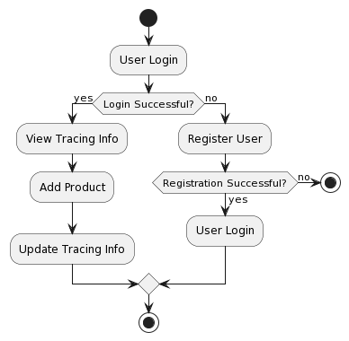
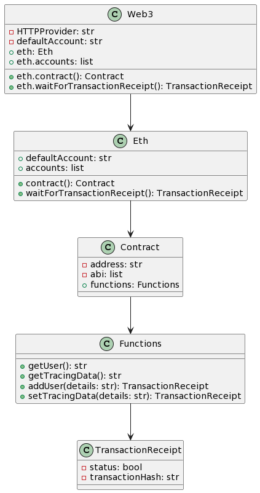
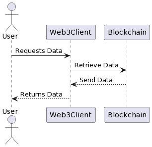
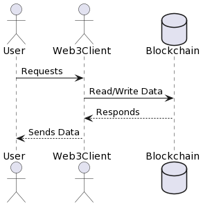
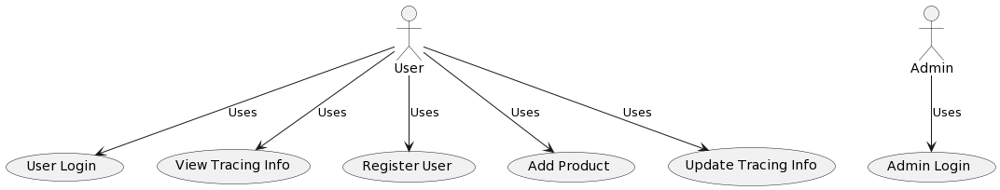

# DrugTraceability

<p align="center">
  
</p>


---

## Table of Contents
- [Project Overview](#project-overview)
- [Features](#features)
- [Screenshots](#screenshots)
- [Getting Started](#getting-started)
- [Project Structure](#project-structure)
- [Contributing](#contributing)
- [License](#license)
- [Tips for Viewers](#tips-for-viewers)

---

## 🚀 Project Overview
DrugTraceability is a blockchain-integrated Django web application designed to ensure the authenticity and traceability of pharmaceutical drugs throughout the supply chain. It leverages blockchain technology for secure, transparent, and tamper-proof record-keeping.

---

## ✨ Features
- 🔗 **Blockchain Integration:** Track every transaction and movement of drugs securely.
- 🏥 **Multi-role System:** Supports manufacturers, distributors, pharmacies, and consumers.
- 📦 **Batch Management:** Add, update, and verify drug batches.
- 🖼️ **Image Uploads:** Attach images to batches for verification.
- 📊 **User-friendly Dashboard:** Visualize supply chain data and drug status.
- 🔒 **Authentication:** Secure login and role-based access.

---

## 📸 Screenshots
| Activity Diagram | Class Diagram |
|------------------|--------------|
|  |  |

| Collaboration Diagram | Data Flow Diagram |
|-----------------------|------------------|
|  |  |

| Sequence Diagram | Use Case Diagram |
|------------------|-----------------|
|  |  |

---

## 🖼️ Application Screenshots

| Dashboard | Login Page |
|-----------|------------|
|  |  |

| Admin Interface | Add New Drug |
|-----------------|--------------|
|  |  |

| Drug Details | Client Interface |
|--------------|-----------------|
|  |  |

**Descriptions:**
- **Dashboard:** Main landing page showing project title and navigation.
- **Login Page:** User authentication form.
- **Admin Interface:** Admin dashboard with options to add drugs, view products, and update tracing.
- **Add New Drug:** Form for registering new drugs in the system.
- **Drug Details:** Table showing all drugs, their status, and tracing history.
- **Client Interface:** User view for tracking and interacting with the system.

---

## 🏁 Getting Started

### 1. Clone the Repository
```bash
git clone https://github.com/saketh-02/DrugTraceability.git
cd DrugTraceability
```

### 2. Set Up a Virtual Environment
```bash
python -m venv venv
```

### 3. Activate the Virtual Environment
- **Windows (PowerShell):**
  ```powershell
  .\venv\Scripts\Activate
  ```
- **Windows (CMD):**
  ```cmd
  venv\Scripts\activate.bat
  ```
- **Linux/Mac:**
  ```bash
  source venv/bin/activate
  ```

### 4. Install Dependencies
```bash
pip install -r requirements.txt
```

### 5. Run Database Migrations
```bash
python manage.py migrate
```

### 6. Start the Development Server
```bash
python manage.py runserver
```

Visit [http://127.0.0.1:8000/](http://127.0.0.1:8000/) in your browser.

---

## 📦 Project Structure
```
DrugTraceability/
├── DrugTrace/           # Django project settings
├── DrugTraceApp/        # Main app logic
├── media/               # Uploaded images
├── venv/                # Virtual environment (do not upload to GitHub)
├── requirements.txt     # Python dependencies
├── manage.py            # Django management script
└── ...
```

---

## 🤝 Contributing
1. Fork the repo
2. Create your feature branch (`git checkout -b feature/AmazingFeature`)
3. Commit your changes (`git commit -m 'Add some AmazingFeature'`)
4. Push to the branch (`git push origin feature/AmazingFeature`)
5. Open a Pull Request

---

## 📝 License
This project is licensed under the MIT License.

---

## 💡 Tips for Viewers
- **Try out the demo data** or add your own batches to see the blockchain in action!
- **Check the code comments** for learning about Django and blockchain integration.
- **Open issues or suggestions** are welcome!

---

> Made with ❤️ for secure healthcare supply chains. 